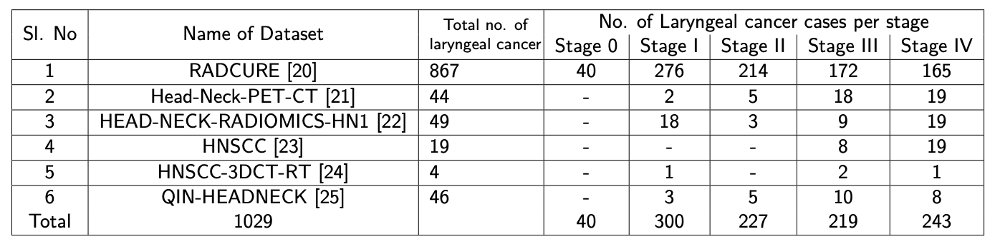

# CTData Preparation for Laryngeal CT Imaging

Despite the rich body of research in head and neck cancer, laryngeal cancer imaging lacks a dedicated public dataset for model development and comparison. We introduce the first curated laryngeal cancer dataset derived from six prominent Cancer Image Archive (TCIA) collections. To support efficient model training and reduce computational overhead, we extracted 1 mm isotropic volumes centered on the laryngeal region, extending from the epiglottis to the cricoid cartilage. Comprising 1,029 computed tomography (CT) images, our benchmark dataset is constructed through a reproducible and fully documented workflow. Though direct image sharing is restricted by TCIA licensing, we release detailed cropping parameters and an open-source image processing pipeline to regenerate the dataset from TCIA originals. This work aims to facilitate reproducible research in segmentation, classification, and prognostic modelling for laryngeal cancer by promoting collaboration and progress in this underrepresented domain.

### STEP 0: Download Datasets from https://www.cancerimagingarchive.net

We select images from six datasets in the Cancer Image Archive https://www.cancerimagingarchive.net. Users are encouraged to register and download 6 public datasets containing computed tomography (CT) scans of patients with confirmed head and neck cancer, including laryngeal cancer. The datasets include: RADCURE, Head-Neck-PET-CT, HEAD-NECK-RADIOMICS-HN1, HNSCC, Head-Neck-3DCT-RT, and QIN-HEADNECK.  All imaging data and associated metadata were downloaded using the National Biomedical Imaging Archive (NBIA) Data Retriever. Clinical annotations included age, sex, tumour subsite, T-stage, and treatment type (surgery, radiotherapy, or chemoradiotherapy), when available. The stage-wise breakdown of the laryngeal cancer cases across the different datasets is summarized in table below.

After downloading RADCURE, Head-Neck-PET-CT, HEAD-NECK-RADIOMICS-HN1, HNSCC, Head-Neck-3DCT-RT, and QIN-HEADNECK, users should put them under the "data/tcia" folder. If the "tcia" folder does not exist under the "data" folder, please create one.

NOTE: Make sure you place the downloaded TCIA data folder into the "data" directory and rename it as "tcia"

## Install dependencies

pip install SimpleITK pydicom pynrrd numpy 

## Run
python dataprep.py

### The result will be a set of cropped 3D images in .nrrd formats, stored in "cropped_nrrds" folder. We also provide the labels for classification to different stages in "data/annotations/LaryngealCT_metadata.xlsx". This would help to train a deep learning model.